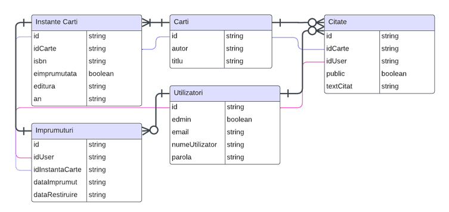
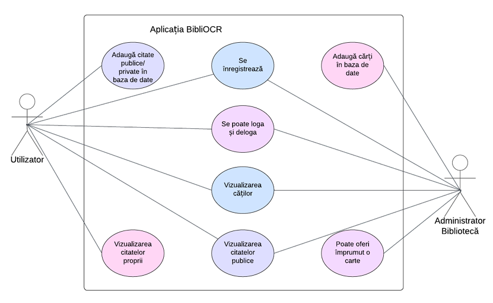
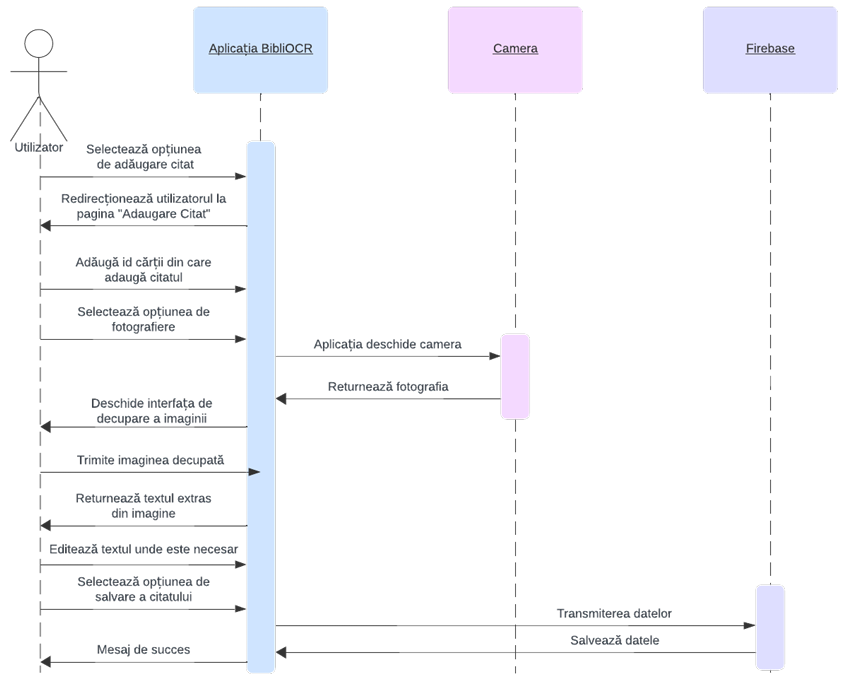

# BibliOCR: Easy Reading through IoT Technologies

[](https://github.com/canhub)
[](https://www.uaic.ro/)
[](https://www.info.uaic.ro/)

**BibliOCR** is the culmination of my Bachelor's studies at the **Faculty of Computer Science**, **Alexandru Ioan Cuza University of Iași**. This project represents the final thesis (Licență) after three years of undergraduate academic research and development.

**BibliOCR** (Smart Library Management System) is an advanced Android ecosystem designed to bridge the gap between physical literature and digital management. By leveraging **Internet of Things (IoT)** concepts and **Artificial Intelligence**, the project simplifies library administration and enhances the reading experience through automated data extraction and real-time cloud synchronization.

> [!NOTE]
> For a comprehensive technical deep-dive, including theoretical background and full methodology, please refer to the main thesis document: [Easy Reading prin tehnologii IoT.pdf](Easy%20Reading%20prin%20tehnologii%20IoT.pdf).

## 📱 Application Preview

<p align="center">
  
</p>

---

## 📺 Project Showcase

Experience the live functionality of **BibliOCR** through the following demonstrations:

| Feature | Video Preview |
| :--- | :--- |
| **Admin: Automated Book Entry** |  |
| **User: Book Browsing & Borrowing** |  |
| **OCR Quote Extraction** |  |
| **Library Management Dashboard** |  |
| **User Experience Flow** |  |

---

## 🚀 Core Features

### 🛠️ Smart Administration
*   **Zero-Typing Data Entry**: Admins can register new books simply by pointing the camera at the cover. The system automatically extracts **Author**, **Title**, **ISBN**, and **Publisher** using AI.
*   **Inventory Lifecycle Management**: Tracks individual physical copies (instances) of books, managing their availability status in real-time.
*   **User Management**: Controlled access for different roles (Admin/User).

### 📖 Enhanced User Experience
*   **Digital Library Browsing**: A clean, real-time list of available books with detailed information.
*   **Smart Book Borrowing**: Users can reserve and borrow physical copies, with automatic status updates across the server.
*   **The "Easy Reading" Suite**: Allows readers to capture favorite passages and convert them into digital quotes using the integrated OCR engine.

---

## 🏗️ Technical Architecture

The project follows a robust Client-Cloud architecture:

### 📊 Database Schema (ER Diagram)
*The ER diagram illustrates the relational structure implemented within a NoSQL Firestore environment.*



### 🔄 System Logic (UML Diagrams)

#### Use Case Diagram


#### Sequence Diagram (OCR & Cloud Sync)


---

## 🧠 Technical Difficulty & Innovation

Developing **BibliOCR** presented several complex engineering challenges:

1.  **AI-Driven Precision**: To achieve a seamless OCR experience, the system utilizes the **Google ML Kit (Text Recognition API)** for robust text extraction. To enhance the accuracy of these APIs, we integrated the [Android-Image-Cropper](https://github.com/CanHub/Android-Image-Cropper) library, which allows users to precisely crop and isolate the text area before processing. This combination effectively handles varying lighting, font styles, and angles.
2.  **NoSQL Relational Mapping**: Managing complex relationships (Users ↔ Loans ↔ Book Instances ↔ Quotes) in **Firebase Firestore** (a NoSQL document-based DB) required implementing custom transaction logic and atomic counters to prevent race conditions during high-frequency borrowing.
3.  **Security Hierarchy**: Passwords are never stored in plain text. We implemented **BCrypt** hashing directly on the client-side/logic layer to ensure enterprise-grade security within a student project context.
4.  **Real-Time State Consistency**: Ensuring that a book marked as "Borrowed" on one device instantly disappears from the "Available" list on all other devices through Firestore Snapshots.

---

## 💎 Utility & Business Value

*   **Operational Efficiency**: Reduces the time required to catalog a new book from ~2 minutes (manual typing) to **under 10 seconds** (OCR scan).
*   **Academic Support**: Provides students with a centralized, searchable database of their scanned physical book quotes.
*   **IoT Ready**: The project is architected as an IoT gateway, capable of future expansion into NFC-tagged bookshelves or automated hardware kiosks.

---

## 🛠️ Installation & Setup

1.  **Clone the Repository**:
    ```bash
    git clone https://github.com/your-repo/bibliocr.git
    ```
2.  **Configure Firebase**:
    -   Add `google-services.json` to the `sample/` directory.
    -   Enable Firestore and Authentication in the Firebase Console.
3.  **Build the Project**:
    -   Open in Android Studio.
    -   Sync Gradle and Click **Run**.

---

### 👨‍💻 Developed by
**Easy Reading prin tehnologii IoT** - Technical University Bachelor Thesis.
